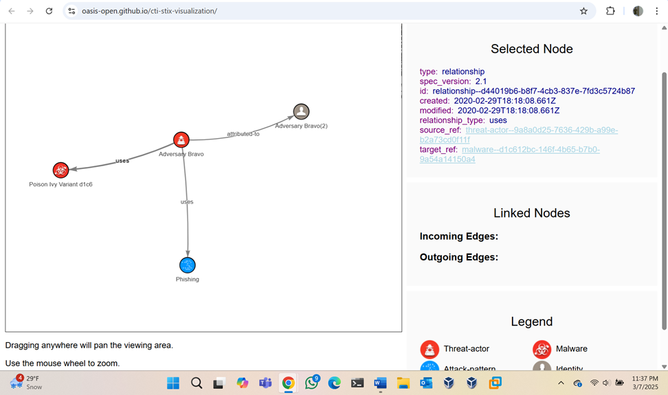
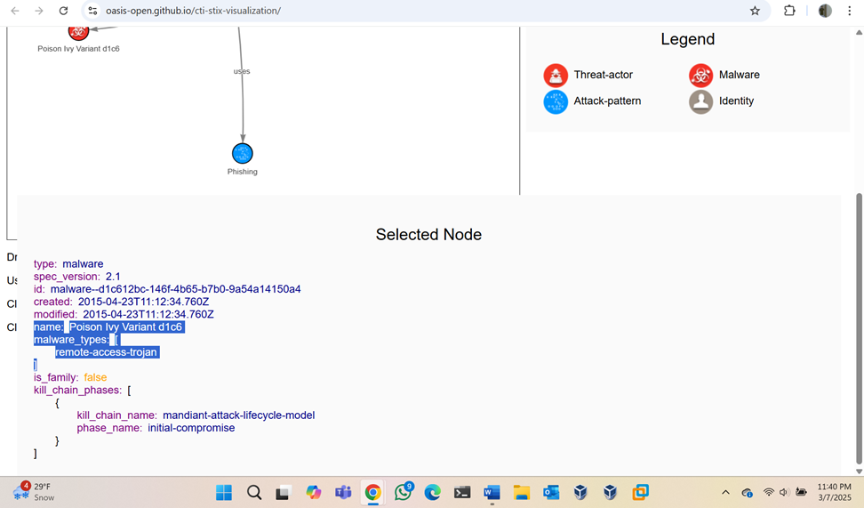
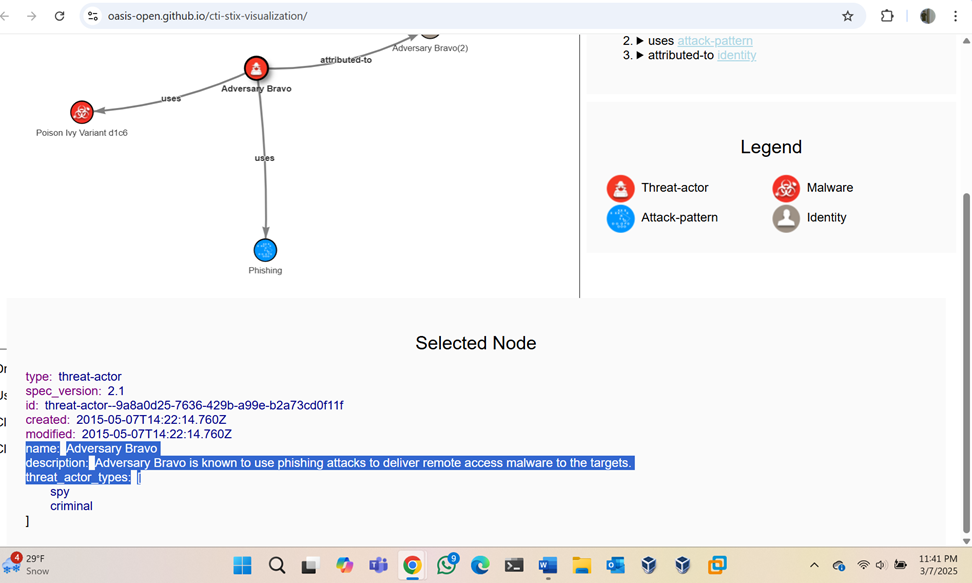
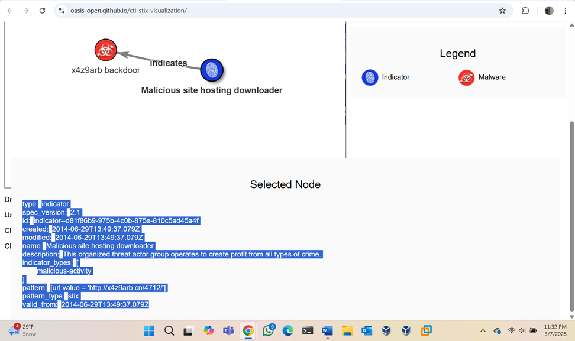

# Threat Intelligence Analysis: STIX Visualization Lab

## Overview
This project explored cyber threat intelligence using STIX (Structured Threat Information eXpression) data and visualization tools. The objective was to understand how indicators, malware, relationships, and threat actors are represented and connected in threat intelligence workflows.

## Objective
- Review STIX-formatted threat intelligence data
- Identify relationships between indicators, malware, and threat actors
- Understand how structured threat intelligence supports security analysis
- Build familiarity with threat intelligence concepts used in cybersecurity operations

## Tools Used
- STIX Visualization tool
- JSON/STIX threat intelligence examples
- Web-based threat intelligence analysis environment

## Environment
This lab used publicly available STIX examples to explore how threat data can be represented, visualized, and interpreted in a structured format.

## Steps Performed
1. Loaded STIX threat intelligence examples into the visualization tool
2. Reviewed graph relationships between indicators, malware, threat actors, and related objects
3. Examined malware details including malware type and associated descriptions
4. Reviewed threat actor information and highlighted descriptive intelligence about attacker behavior
5. Analyzed indicator data such as malicious URLs and how they relate to malware activity
6. Documented how structured threat intelligence can support security analysis and defensive decision-making

## Key Findings
- STIX provides a standardized way to represent and share threat intelligence
- Relationships between objects improve understanding of campaigns, malware, and attacker behavior
- Indicator data such as malicious URLs can provide valuable context for threat detection
- Threat actor descriptions and malware classifications help analysts interpret risk more effectively

## Security Impact
Structured threat intelligence improves security analysis by giving defenders context around indicators of compromise, malware families, and attacker behavior. This supports stronger detection, prioritization, and defensive decision-making in security operations.

## Skills Demonstrated
- Threat intelligence analysis
- Security research
- Pattern interpretation
- Indicator analysis
- Cybersecurity documentation

## Screenshots

### STIX Relationship Graph

### Malware Details

### Threat Actor Details

### Indicator URL Details

- 
