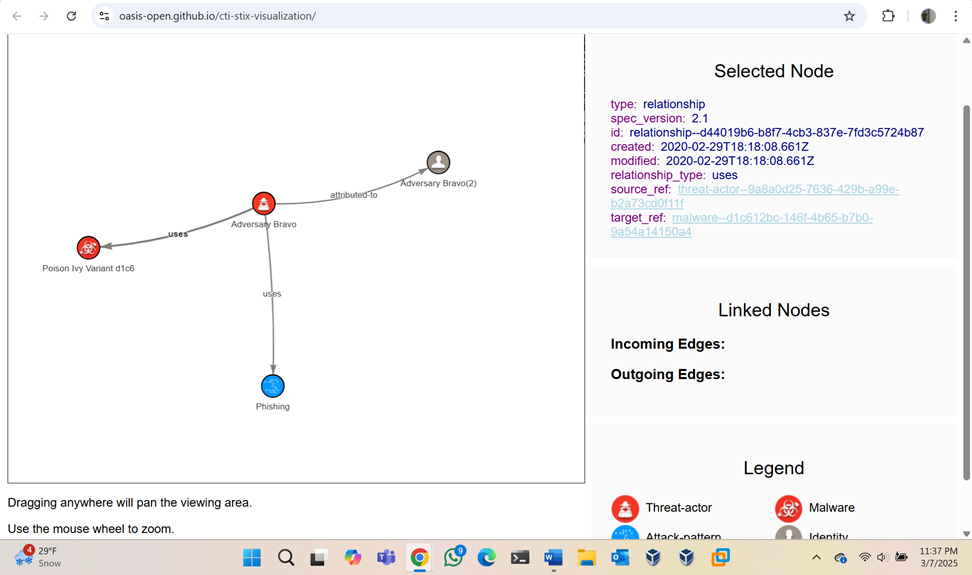
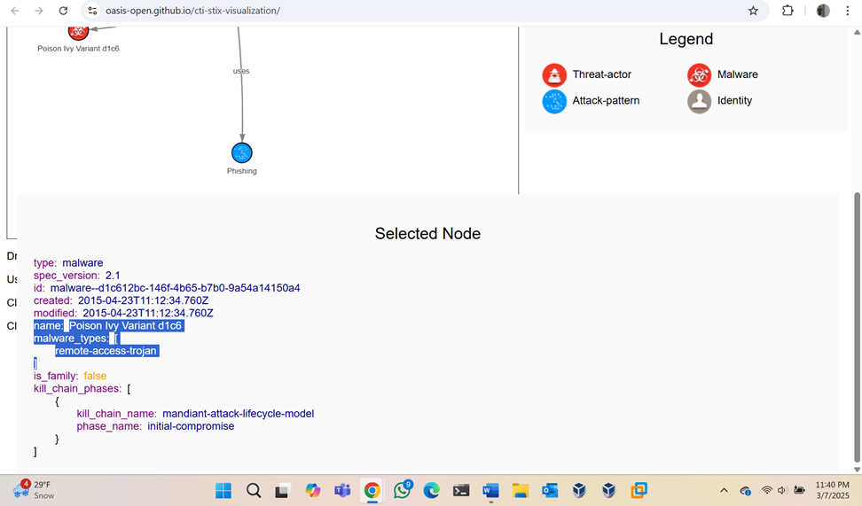
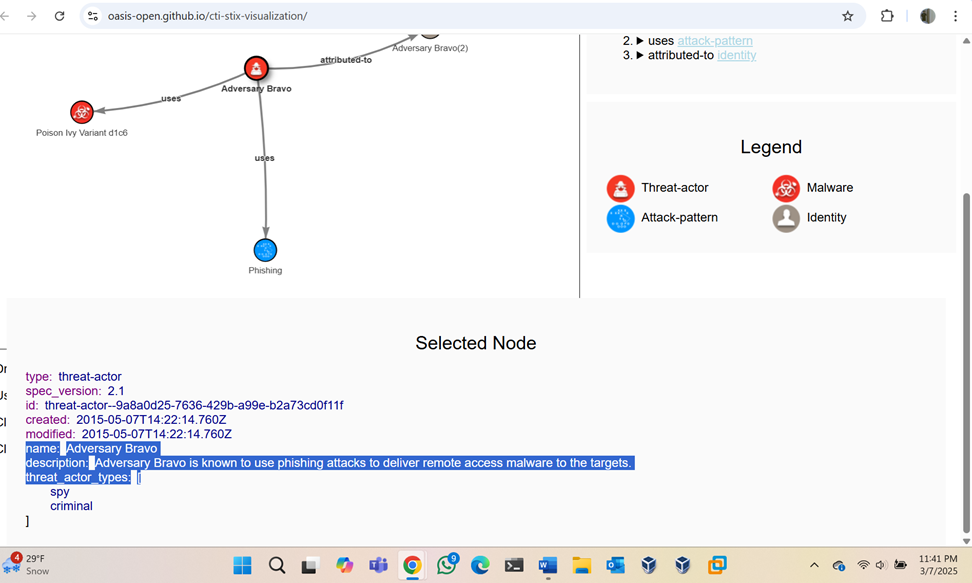
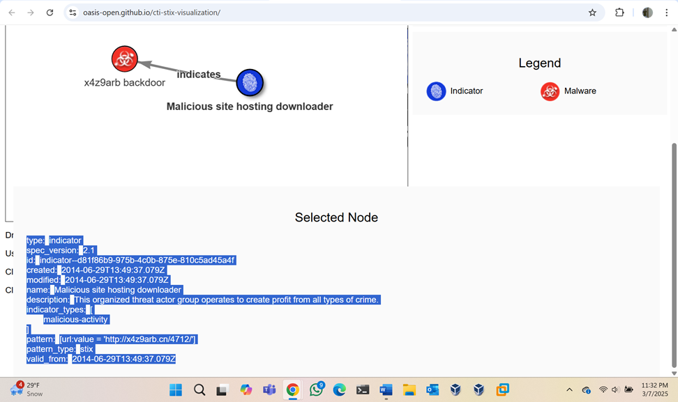

# Threat Intelligence Analysis: STIX Investigation and SOC Application

## Overview

This project demonstrates how structured threat intelligence (STIX/TAXII) is consumed, analyzed, and operationalized in a SOC context. Using STIX-formatted threat data, this investigation mapped relationships between indicators of compromise, malware families, and threat actor TTPs — then translated those findings into actionable detection guidance and KQL-style hunting queries relevant to a Microsoft Sentinel environment.

---

## Objective

- Parse and analyze STIX-formatted threat intelligence data
- Map relationships between IOCs, malware, and threat actors
- Extract actionable intelligence to support alert triage and threat hunting
- Produce detection guidance and hunting queries based on indicator data
- Demonstrate how threat intel feeds accelerate SOC analyst decision-making

---

## Tools Used

- STIX Visualization Tool (OASIS)
- STIX/TAXII threat intelligence format
- MITRE ATT&CK Framework
- KQL (Kusto Query Language) — detection query development
- JSON/STIX data analysis

---

## Environment

This lab used publicly available STIX threat intelligence examples to simulate the consumption and analysis of a threat intelligence feed — replicating the workflow a SOC analyst would use when integrating external TI into a SIEM or threat hunting workflow.

---

## Investigation Walkthrough

### Step 1 — Load and Visualize STIX Data
Imported STIX bundle into the OASIS visualization tool. Identified the following object types present in the dataset:
- **Indicators** (malicious URLs)
- **Malware** (classified by type and behavior)
- **Threat Actors** (with TTP descriptions)
- **Relationships** (linking actors to malware to indicators)

### Step 2 — Analyze the Relationship Graph
Reviewed the object relationship graph to understand the campaign structure. A single threat actor was linked to multiple malware samples, which were linked to specific URL-based indicators used for delivery or C2. Relationship types included uses, indicates, and attributed-to.

**Analyst conclusion:** The graph revealed a campaign pattern where the threat actor used consistent malware tooling across multiple targets, with indicators pointing to shared C2 infrastructure — a pattern that supports proactive blocking and indicator enrichment across alerts.

### Step 3 — Malware Analysis
Reviewed malware object details:
- Malware type classified as trojan with remote access capability
- Description referenced capability to exfiltrate data and establish persistence
- In a real environment, hashes would be cross-referenced against VirusTotal or Microsoft Defender TI

**SOC application:** Malware classification and capability description helps analysts prioritize severity when this family appears in endpoint alerts — remote access trojans with persistence should be treated as high severity and escalated immediately.

### Step 4 — Threat Actor Profiling
Reviewed threat actor object:
- Actor described as financially motivated targeting enterprise environments
- TTPs referenced credential access and lateral movement consistent with MITRE ATT&CK T1078 (Valid Accounts) and T1021 (Remote Services)
- Sophistication level and resource rating noted from STIX object attributes

**SOC application:** Knowing the actor's primary TTPs allows analysts to prioritize detection rules around those specific techniques and elevate alerts that match the actor's known behavior patterns.

### Step 5 — Indicator Analysis and Detection Development
Reviewed malicious URL indicator objects and translated them into detection logic applicable to a Microsoft Sentinel environment.

**KQL hunting query — malicious URL indicator from STIX feed:**
```kql
DeviceNetworkEvents
| where RemoteUrl has_any ("malicious-domain.example.com", "c2-endpoint.example.net")
| where ActionType == "ConnectionSuccess"
| project Timestamp, DeviceName, RemoteUrl, RemoteIP, InitiatingProcessFileName
| order by Timestamp desc
```

**KQL alert rule — threat actor TTP (T1078 - Valid Accounts):**
```kql
let activeAccounts = SigninLogs
| where TimeGenerated > ago(30d)
| summarize by UserPrincipalName;
SigninLogs
| where TimeGenerated > ago(1d)
| where UserPrincipalName !in (activeAccounts)
| where ResultType == 0
| project TimeGenerated, UserPrincipalName, IPAddress, Location, AppDisplayName
```

### Step 6 — Threat Intel Report Production
Produced a structured threat intelligence report documenting malware classifications, threat actor TTP mapping to MITRE ATT&CK, IOC list with context, detection recommendations, and defensive priorities based on actor behavior.

---

## MITRE ATT&CK Mapping

| Technique | ID | Source |
|---|---|---|
| Valid Accounts | T1078 | Threat actor TTP from STIX object |
| Remote Services | T1021 | Threat actor TTP from STIX object |
| Phishing: Malicious Link | T1566.002 | URL indicator pattern in STIX data |
| Command and Scripting Interpreter | T1059 | Malware behavior description |

---

## Key Findings Summary

| Finding | Detail |
|---|---|
| Threat Actor Motivation | Financial |
| Malware Type | Trojan (Remote Access) |
| Indicator Type | Malicious URLs (C2/delivery) |
| Primary TTPs | T1078, T1021, T1566.002 |
| Campaign Pattern | Shared C2 infrastructure across targets |
| Detection Queries Produced | 2 (KQL - Sentinel-compatible) |
| SOC Recommendation | Block indicators, prioritize RAT-related endpoint alerts, hunt for T1078 activity |

---

## Screenshots

### STIX Relationship Graph


### Malware Details


### Threat Actor Details


### Indicator URL Details


---

## Skills Demonstrated

- Threat intelligence consumption and analysis (STIX/TAXII)
- IOC extraction and enrichment
- Threat actor profiling and TTP mapping
- MITRE ATT&CK framework application
- KQL detection query development (Microsoft Sentinel)
- Threat hunting query construction
- Structured threat intelligence reporting
- SOC analyst decision-support documentation
